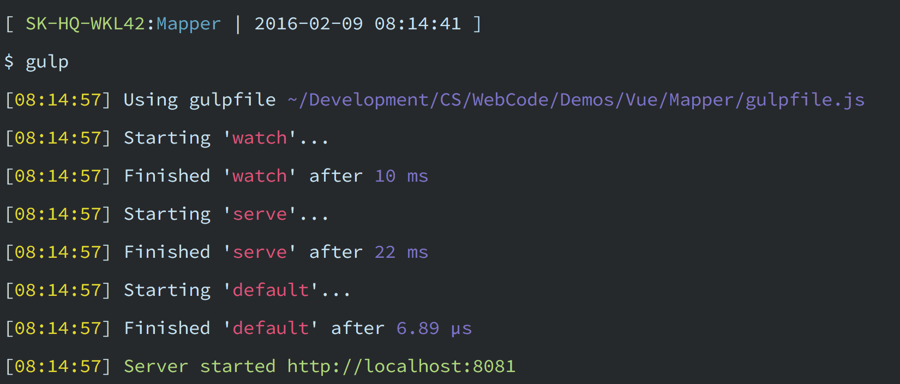

# This build is still in progress

# Mapper

This is a demo file I'm using to prototype the interaction between a vue.js app and a google map instance.

## Mockup

The mockup I put together to rough out the base idea of the Mapper demo can be found [here on draw.io](https://drive.google.com/file/d/0Bxhfk2Nciu7jcFV6ZVBfbUoyS00/view?usp=sharing). (Note that you will need a google account to access the mockup because it's source is stored in google drive).

Also note that not all features of the mockup were implemented. I started building it out and then realized after building a bit that I actually wanted to interact with google places and not just geocode addresses. It was still a worthwhile exploration, but I only wanted to take it as far as geocoding and then leave it there.

## Prerequisites

To launch this project you'll need [Node.js](https://nodejs.org/en/download/) installed. This will install both Node and npm.

You will also need to generate your own google maps API key. Please refer to the [google maps javascript instructions for generating an API key](https://developers.google.com/maps/documentation/javascript/get-api-key). Once you have your key, open the file:

    src/app/Mapper/map.vue

In this line of code replace the 'YOURGOOGLEAPIKEYHERE' with your API Key:

    GoogleMapsLoader.KEY = 'YOURGOOGLEAPIKEYHERE';

## Install and Launch

To get this project up and running:

- Clone the repo to your computer, open a terminal, and `cd` into the root:

	    cd ~/Desktop
	    git clone https://github.com/chris-schmitz/Mapper.git Mapper
	    cd VueToDos

- Install the project dependencies using `npm` (installed when you install node):

	    npm install

- Start the default task in `gulp` (installed when you run npm install):

    	./node_modules/.bin/gulp

- In your terminal you should see the url for the server that this project starts:

	
